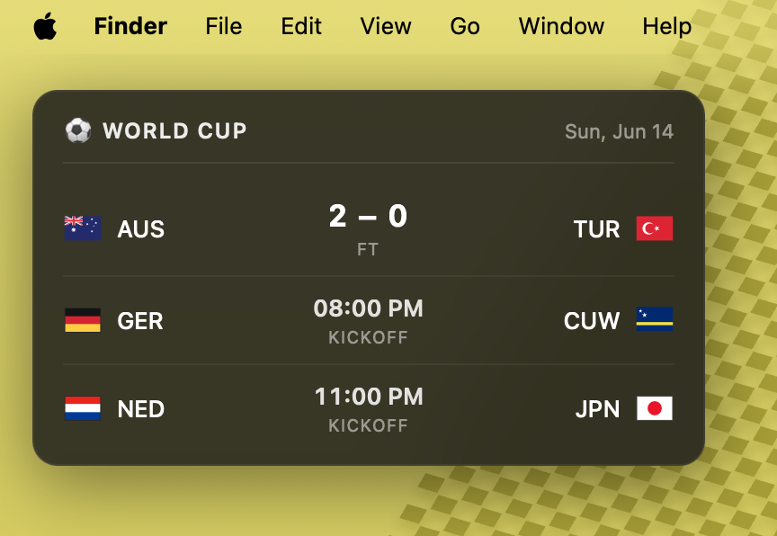

# World Cup Widget for Übersicht

A minimal macOS desktop widget that shows today's FIFA World Cup matches with live scores, team flags, and a live indicator. Data comes from ESPN's public scoreboard endpoint — no API key required.



## Features

- Today's matches only, filtered to your local timezone
- Live scores with a pulsing red dot for in-progress games
- Kickoff time for upcoming matches, final score with "FT" for finished ones
- Refreshes every 30 seconds
- Frosted-glass styling that sits nicely on any wallpaper

## Requirements

- macOS
- [Übersicht](https://tracesof.net/uebersicht/) — a free app that runs desktop widgets written in HTML/CSS/JS

## Installation

**1. Install Übersicht**

Either:

​```bash
brew install --cask ubersicht
​```

or download the `.dmg` from [tracesof.net/uebersicht](https://tracesof.net/uebersicht/) and drag it to Applications.

**2. Grant screen recording permission**

On first launch, macOS will ask. Allow it under *System Settings → Privacy & Security → Screen & System Audio Recording*, then quit and reopen Übersicht.

**3. Install this widget**

​```bash
git clone https://github.com/bisharahakim/world-cup-widget.git
mv world-cup-widget ~/Library/Application\ Support/Übersicht/widgets/world-cup.widget
​```

Or click the **Ü** menu bar icon → *Open Widgets Folder*, and drop the `world-cup.widget` folder in there manually.

The widget should appear on your desktop within a second. If not, click the **Ü** menu bar icon → *Refresh All Widgets*.

## Customization

Edit `index.jsx` and save — Übersicht hot-reloads automatically.

**Position** — change the `top` and `right` (or `left`/`bottom`) values at the top of the `className` block.

**Refresh rate** — change `refreshFrequency` (milliseconds).

**Other competitions** — swap the URL path in the `command` line. Examples:

| Competition | Path |
|---|---|
| FIFA World Cup | `fifa.world` |
| UEFA Champions League | `uefa.champions` |
| Premier League | `eng.1` |
| La Liga | `esp.1` |
| Serie A | `ita.1` |
| Bundesliga | `ger.1` |

## How it works

Übersicht runs the `command` (a `curl` to ESPN's scoreboard endpoint) on the refresh interval and passes the output to `render`. The widget parses the JSON, filters events to today's date in local time, and draws each match with the home team on the left, away team on the right, and the score (or kickoff time) in the middle.

## License

MIT